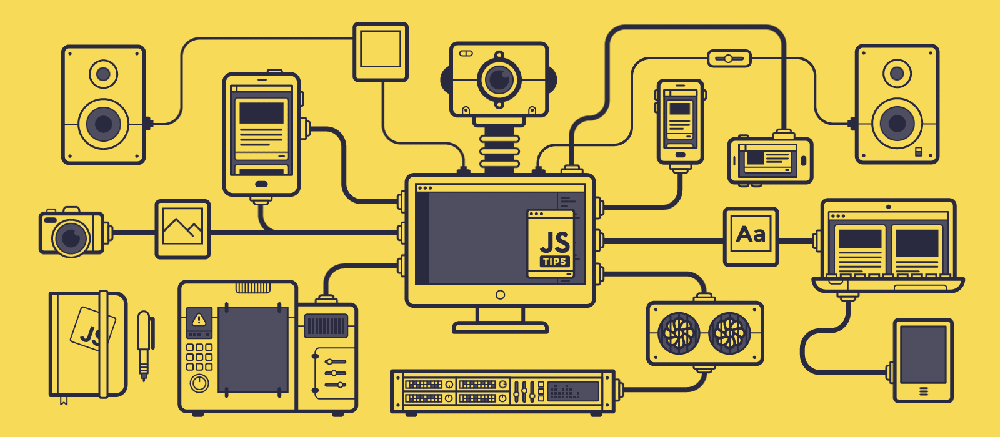

<!--Banner-->

<!--Night Owl image-->

  

<!--Header Name-->

#  ɪ'ᴍ Rohit Tiwari!

_Digital Craftsman (Software Developer / Web App Developer)_
 

<!--Start Intro-->

I am a Full Stack Developer and SAAS Developement Enthusiast with a huge love for Next js, React.js, Node.js, Spring Boot, RDBMS, REST API, tRPC and have good experience in OCPP. 

- 🔭 I’m currently working on **NirvanaMeet Video Conferencing Solution**
- 🌱 I’m currently learning **React-JS,Angular, Spring Boot(Java), Node-JS, Mongo Db**
- 🤝 I’m looking for help with **Deploying Full-Stack Project on Github**
- 👨‍💻 All of my projects are available at [https://rohittiwari-dev.github.io/rohit-dev/](https://rohittiwari-dev.github.io/rohit-dev/)
- 💻 Conatct ME or Visit My Portfolio [https://prorohit.netlify.app/)
- 💬 Ask me about **React, Angular, Spring Boot - Apis, Node JS-Express**
- 📫 How to reach me **tigertiwari1023@gmail.com**
- ⚡ Fun fact **I Think I am GOD in Full Stack 😂🤣 Development (Just Joking 🤣)**
<!--End Intro-->

<!--Profile Count Badge-->

  

---

<!--Languages and Tools Section-->

<h2 align="center">Tᴇᴄʜ sᴛᴀᴄᴋ & Lᴀᴛᴇsᴛ ʙʟᴏɢs</h2> 
<picture >
  <source width="50%" media="(prefers-color-scheme: dark)" srcset="./Skills_Animation_Dark.gif">
  <source width="50%" media="(prefers-color-scheme: light)" srcset="./Skills_Animation_White.gif">
  
</picture>
 

<h3 align="left">Current Learning</h3>
<ul align="left">
  <li>Deepening my knowledge in Machine Learning and AI.</li>
  <li>Exploring advanced React.js 19 and Next js 15 patterns and state management techniques.</li>
  <li>Improving my skills in cloud computing with AWS and Azure.</li>
  <li>Developing Note Making Space Saas Application for College/School Student</li>
</ul>
  
<h3 align="left">I have Worked For</h3>
<ul align="left">
  <li><a href="https://yano.co.in">Helped Setting up core Structure and Project Estabilshment in OCPP EV Charging Network in  </a></li>
  <li><a href="https://dev.to/dev_kiran/open-source-hidden-gems-v2-4e8j">✨Open-Source Contribution in OCPP-RPC helped type support to the app</a></li>

</ul>
 
 
 
 

<!--Trophies Section-->
<h2 align="center">🏆 Gɪᴛʜᴜʙ Tʀᴏᴘʜɪᴇs 🏆</h2>

  <a href="https://github.com/rohittiwari-dev">
    <picture>
      <source media="(prefers-color-scheme: dark)" srcset="https://github-trophies.vercel.app/?username=rohittiwari-dev&no-bg=true&row=2&column=6&margin-w=20&margin-h=20&theme=monokai">
      <source media="(prefers-color-scheme: light)" srcset="https://github-trophies.vercel.app/?username=rohittiwari-dev&no-bg=true&row=2&column=6&margin-w=20&margin-h=20">
      
    </picture>
  </a>

  

 

<!--Github stats Table-->
<h2 align="center">📊 Gɪᴛʜᴜʙ Sᴛᴀᴛs 📊</h2>

<table width="100%" align="center">
  <tr>
    <!-- <td width="50%">
      <h3 align="center"><strong>Gɪᴛʜᴜʙ Sᴛᴀᴛs</strong></h3>
      

        
      

    </td> -->
    <td width="50%">
      <h3 align="center"><strong>Sᴛʀᴇᴀᴋ Sᴛᴀᴛs</strong></h3>
      

        
      

    </td>
  </tr>
  <tr>
    <!-- <td width="50%">
      <h3 align="center"><strong>Lᴀᴛᴇsᴛ Pʀᴏᴊᴇᴄᴛ</strong></h3>
      

        
      

    </td> -->
    <td width="50%">
      <h3 align="center"><strong>Tᴏᴘ Cᴏɴᴛʀɪʙᴜᴛɪᴏɴs</strong></h3>
      

        
      

    </td>
  </tr>
</table>
 

<!--Contribution Graph-->
<h2 align="center">📈 Cᴏɴᴛʀɪʙᴜᴛɪᴏɴ Gʀᴀᴘʜ 📈</h2>

    

<!--Contact Section-->

<h2 align="center">🤝 Cᴏɴɴᴇᴄᴛ Wɪᴛʜ Mᴇ 🤝 </h2>

<!-- Buy me a coffee -->

<!--Footer-->

  

